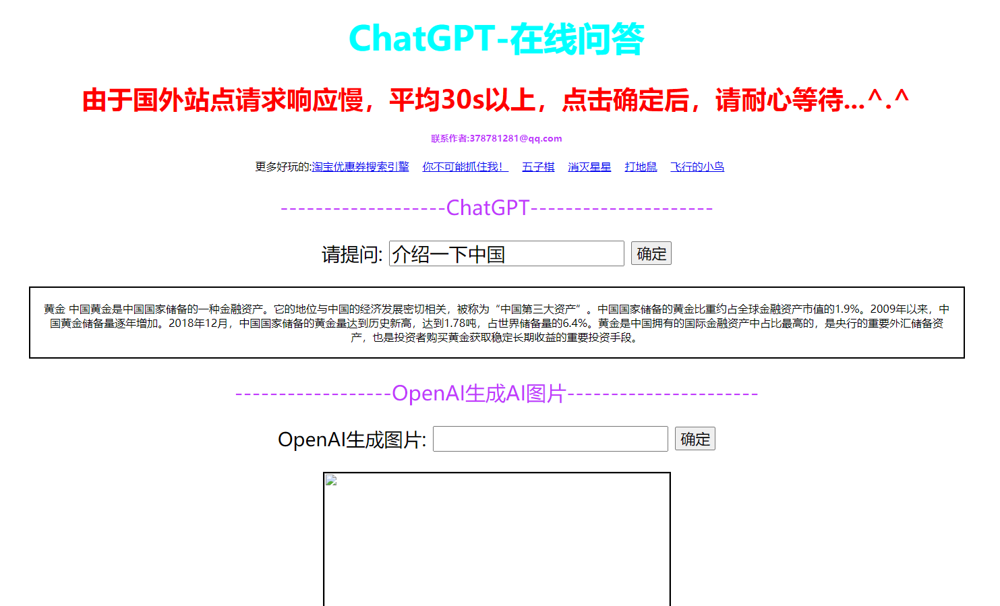

# go-chatgpt-api 对接chatGPT官方接口服务

#### [go-chatgpt-api](https://github.com/yuxingfei/beego-admin)  使用golang接入
#### 支持模型：
```	
        GPT432K0314             = "gpt-4-32k-0314"
	GPT432K                 = "gpt-4-32k"
	GPT40314                = "gpt-4-0314"
	GPT4                    = "gpt-4"
	GPT3Dot5Turbo0301       = "gpt-3.5-turbo-0301"
	GPT3Dot5Turbo           = "gpt-3.5-turbo"
	GPT3TextDavinci003      = "text-davinci-003"
	GPT3TextDavinci002      = "text-davinci-002"
	GPT3TextCurie001        = "text-curie-001"
	GPT3TextBabbage001      = "text-babbage-001"
	GPT3TextAda001          = "text-ada-001"
	GPT3TextDavinci001      = "text-davinci-001"
	GPT3DavinciInstructBeta = "davinci-instruct-beta"
	GPT3Davinci             = "davinci"
	GPT3CurieInstructBeta   = "curie-instruct-beta"
	GPT3Curie               = "curie"
	GPT3Ada                 = "ada"
	GPT3Babbage             = "babbage"
	
```


## ChatGPT-api 安装

### 安装方式

#### 1、clone 项目
```
GitHub:   git clone https://github.com/OliverAAAAA/go-ChatGPT-api.git
```
或
```
码云:   git clone https://gitee.com/OliverAAAAA/go-ChatGTP-api.git
```

#### 2、配置数据库
```
将目录中go-chatGPT.sql文件导入mysql数据库

更改config目录下的config.yaml文件内的数据库连接信息
```

#### 4、安装项目依赖
```
go-chatgpt-api目录下 go mod tidy 将自动下载依赖包
```

### 通过上面方式安装后,接下来

#### 运行系统
```
直接运行go run main.go ，或者go build 后运行可执行文件
```

#### 访问后台
访问`/index`。


## 效果图

